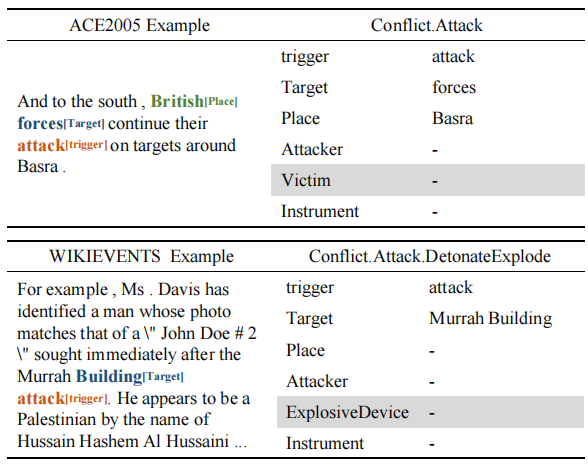

# UnifiedEAE

Source code for the paper, ["[A Multi-Format Transfer Learning Model for Event Argument Extraction via Variational Information Bottleneck](https://arxiv.org/abs/2208.13017)"], in COLING 2022.

## Overview

The transfer between different event argument extraction is a challenging task.

- One challenge is that the formats of various datasets are inconsistent due to the complex structure of event records. Thus, it is hard to find a unified model to extract arguments with different formats.

- The another challenge is that the annotation among different datasets may exist a gap, which brings noise for transfer learning. Two datasets may have significant semantic differences, as they may belong to different domains. In addition, the annotation guidelines may be contradictory among various datasets.

Below we show an example to intuitively illustrate these two challenges.



To deal with the above challenges, we propose a multi-format transfer learning model for EAE via information bottleneck,  denoted as **UnifiedEAE**, which can leverage all event extraction datasets with heterogeneous formats. 

- First, we adopt a Shared-Specific Prompt (**SSP**) framework to capture format-shared and format-specific knowledge to extract arguments with different formats.
- Then, to better capture the format-shared representation, we incorporate the variational information bottleneck (VIB) into the format-shared model (**SharedVIB**). 

The following figure shows the overall architecture of **UnifiedEAE**, for more details, please refer to our paper.


## Dataset

Our experiments are conducted on the three widely-used datasets for event argument extraction task: ACE2005, RAMS and WiKiEvents.

	


## Usage

### Environment

To run our code, please install all the dependency packages by using the following command:

```
pip install -r requirements.txt
```

### Run the model

You could simply run UnifiedEAE with following commands:

```
bash ./scripts/train_ace.sh
```

## Citation

If you find our work interesting, you can cite the paper as

```
@article{zhou2022multi,
  title={A Multi-Format Transfer Learning Model for Event Argument Extraction via Variational Information Bottleneck},
  author={Zhou, Jie and Zhang, Qi and Chen, Qin and He, Liang and Huang, Xuanjing},
  journal={arXiv preprint arXiv:2208.13017},
  year={2022}
}
```
